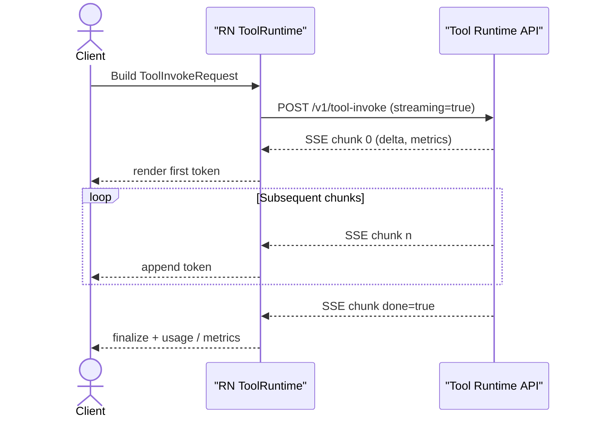

# Tool Runtime Interface v0.1

> **Status**: Draft – 2025‑04‑29  
> **Owner**: AI Architect (DeepSeek / Qwen)

---

## 1 Overview

This document定义了 _Tool Invoke_ 统一接口，用于前端（React Native）或工作流引擎调用已注册 **LocalTool**。接口支持流式返回与统一指标埋点，并附带 Mock 方案便于离线调试。

---

## 2 API 入口

| Method | Path              | Description                                   |
| ------ | ----------------- | --------------------------------------------- |
| `POST` | `/v1/tool-invoke` | 调用指定 Tool，支持 SSE 增量返回或一次性 JSON |

> 🚩 约定：若 `streaming=true`，服务端以 `text/event-stream` 发送 `ToolInvokeChunk`；否则直接返回 `ToolInvokeChunk[]` 数组。

---

## 3 字段参考（v0.1）

### 3.1 `ToolInvokeRequest`

| 字段           | 类型                                        | 必填 | 说明                                    |
| -------------- | ------------------------------------------- | ---- | --------------------------------------- |
| `toolId`       | `string`                                    | ✓    | 对应 `LocalTool.id`                     |
| `sessionId`    | `string`                                    | ✓    | 前端 / Engine 生成的对话或工作流实例 ID |
| `invocationId` | `string`                                    | ✓    | 一次 Tool 调用唯一 ID，用于回包路由     |
| `input`        | `object`                                    | ✓    | Tool 自定义输入载荷                     |
| `streaming`    | `boolean`                                   |  –   | 默认为 `false`；`true` 则 SSE 回包      |
| `params`       | `Record<string,unknown>`                    |  –   | 推理附加参数（温度、图片格式…）         |
| `meta`         | `{ locale?:string;<br>clientTime?:string }` |  –   | 客户端信息                              |

### 3.2 `ToolInvokeChunk`

| 字段           | 类型                                            | 必填 | 说明                                       |
| -------------- | ----------------------------------------------- | ---- | ------------------------------------------ |
| `invocationId` | `string`                                        | ✓    | 与请求对应                                 |
| `index`        | `number`                                        | ✓    | 分片序号，从 0 递增                        |
| `delta`        | `string`                                        | ✓    | 新增 token / 片段文本                      |
| `done`         | `boolean`                                       | ✓    | `true` = 完成                              |
| `usage`        | `{ promptTok:number;<br>completionTok:number }` |  –   | 仅末片返回                                 |
| `metrics`      | `{ latencyMs:number;<br>tps:number }`           |  –   | 首片携带 TTFB；末片携带平均 TPS            |
| `error`        | `{ code:string;<br>message:string }`            |  –   | 若调用失败，`done=true & error!=undefined` |

---

## 4 时序图



---

## 5 Mock 数据示例

### 5.1 请求样例 (`deepseek_chat`)

```jsonc
{
  "toolId": "deepseek_chat",
  "sessionId": "sess_20250429_x1",
  "invocationId": "inv_001",
  "input": { "text": "Explain MVP scope in one sentence." },
  "streaming": true,
  "params": { "temperature": 0.3 },
}
```

### 5.2 SSE 返回片段

```jsonc
// event: message
data: { "invocationId":"inv_001", "index":0, "delta":"The ", "done":false, "metrics":{"latencyMs":420} }

data: { "invocationId":"inv_001", "index":1, "delta":"MVP ", "done":false }
...

data: { "invocationId":"inv_001", "index":12, "delta":"users.", "done":true, "usage":{"promptTok":15,"completionTok":13}, "metrics":{"tps":25.6} }
```

---

## 6 本地模拟伪代码

```ts
// ./scripts/localMock.ts
import { createServer } from "http";
import { parse } from "url";

createServer((req, res) => {
  if (req.method === "POST" && parse(req.url!).pathname === "/v1/tool-invoke") {
    const body: Buffer[] = [];
    req.on("data", (c) => body.push(c));
    req.on("end", () => {
      const invoke = JSON.parse(Buffer.concat(body).toString());
      // 1️⃣ 首 token 延迟
      setTimeout(() => {
        res.writeHead(200, {
          "Content-Type": "text/event-stream",
          "Cache-Control": "no-cache",
          Connection: "keep-alive",
        });
        const words = "Mock result from local server.".split(" ");
        words.forEach((w, i) =>
          setTimeout(() => {
            res.write(
              `data: ${JSON.stringify({ invocationId: invoke.invocationId, index: i, delta: w + " ", done: false })}\n\n`,
            );
          }, i * 80),
        );
        // 2️⃣ done 片段
        setTimeout(
          () => {
            res.write(
              `data: ${JSON.stringify({ invocationId: invoke.invocationId, index: words.length, delta: "", done: true })}\n\n`,
            );
            res.end();
          },
          words.length * 80 + 20,
        );
      }, 350);
    });
  }
}).listen(7078, () => console.log("Mock runtime listening on port 7078"));
```

> 运行：`yarn dlx ts-node scripts/localMock.ts`，前端在 `.env` 中设置 `TOOL_ENDPOINT=http://127.0.0.1:7078` 即可脱机调试。

---

## 7 Mock Runtime PoC (0‑6)

### 7.1 最小脚本 `scripts/localMock.ts`

```ts
import { createServer } from "http";

// 🌱 PoC: always respond "Hello ToolRuntime" as SSE or plain text
createServer((req, res) => {
  if (req.method === "POST" && req.url === "/v1/tool-invoke") {
    res.writeHead(200, {
      "Content-Type": "text/event-stream",
      "Cache-Control": "no-cache",
      Connection: "keep-alive",
    });
    res.write(`data: Hello ToolRuntime

`);
    res.end();
  } else {
    res.writeHead(404);
    res.end();
  }
}).listen(7078, () => console.log("Mock runtime PoC on :7078"));
```

### 7.2 运行与验证

1. 启动 Mock：

   ```bash
   yarn dlx ts-node scripts/localMock.ts
   ```

2. 打开新终端，执行 cURL：

   ```bash
   curl -X POST -H "Content-Type: application/json" \
        -d '{"toolId":"ping","sessionId":"s1","invocationId":"i1","input":{}}' \
        http://127.0.0.1:7078/v1/tool-invoke
   ```

   应输出：

   ```text
   data: Hello ToolRuntime
   ```

3. 若需一次性 JSON 流程，可删掉 SSE 头，将 `res.writeHead` 的 `Content-Type` 改为 `application/json`。

> ✅ 以上步骤即满足 "0‑6 Mock Runtime PoC" 需求。

变更记录

| 版本 | 日期       | 说明                                                   |
| ---- | ---------- | ------------------------------------------------------ |
| 0.1  | 2025‑04‑29 | 首版：请求/响应字段、Mermaid 时序图、Mock 样例、伪代码 |
